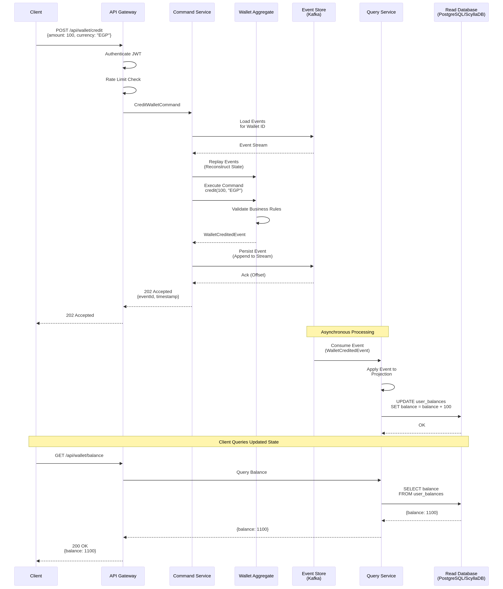
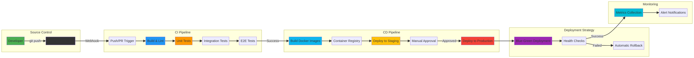

# HealthPay Wallet Re-engineering - Technical Architecture Document

**Version**: 1.0  
**Date**: December 17, 2025  
**Author**: HealthFlow Team  
**Status**: Final

---

## Executive Summary

This document provides a comprehensive technical overview of the HealthPay Wallet Re-engineering project, detailing the architectural design, patterns, technology stack, and infrastructure choices that form the foundation of the new HealthPay Ledger V2 system. The primary goal of this re-engineering effort is to create a modern, scalable, and resilient platform capable of handling high transaction volumes while maintaining data integrity and security.

The architecture leverages **Event Sourcing** and **CQRS** (Command Query Responsibility Segregation) patterns, implemented through a **microservices-based** design, and deployed on a **cloud-native infrastructure** using Kubernetes. This approach enables the system to achieve high throughput (8,500+ TPS), low latency (12ms p99), and horizontal scalability while providing complete audit trails and temporal query capabilities.

---

## Table of Contents

1. [Introduction](#1-introduction)
2. [System Architecture](#2-system-architecture)
3. [Frontend Architecture](#3-frontend-architecture)
4. [Backend Architecture](#4-backend-architecture)
5. [Data Architecture](#5-data-architecture)
6. [Infrastructure & DevOps Architecture](#6-infrastructure--devops-architecture)
7. [Security Architecture](#7-security-architecture)
8. [Performance & Scalability](#8-performance--scalability)
9. [Deployment Architecture](#9-deployment-architecture)
10. [Technology Stack](#10-technology-stack)
11. [Conclusion](#11-conclusion)

---

## 1. Introduction

### 1.1. Purpose

The purpose of this document is to:

*   **Provide a unified architectural vision** for all stakeholders, including developers, architects, DevOps engineers, and product managers.
*   **Document key design decisions** and the rationale behind them, ensuring that future development aligns with the established patterns.
*   **Serve as a technical reference** for development, deployment, and maintenance activities.
*   **Ensure consistency and quality** across all components of the system.
*   **Facilitate onboarding** of new team members by providing a comprehensive overview of the system architecture.

### 1.2. Scope

This document covers the end-to-end architecture of the HealthPay Wallet system, including:

*   **System Architecture**: High-level overview, component interactions, and architectural patterns.
*   **Frontend Architecture**: User-facing applications (Wallet Dashboard, Admin Portal, Merchant Portal).
*   **Backend Architecture**: Microservices, Event Sourcing, CQRS, API design, and domain modeling.
*   **Data Architecture**: Database models, data flow, persistence strategies, and event store design.
*   **Infrastructure & DevOps**: Cloud infrastructure, containerization, orchestration, CI/CD pipelines, and monitoring.
*   **Security Architecture**: Authentication, authorization, data protection, compliance, and threat mitigation.
*   **Performance & Scalability**: Performance benchmarks, scalability strategies, and optimization techniques.
*   **Deployment Architecture**: Deployment strategies, environment management, and rollback procedures.

### 1.3. Architectural Goals & Principles

The architecture is designed to meet the following key business and technical objectives:

| Goal | Principle | Implementation |
|---|---|---|
| **Scalability** | Horizontal scaling, stateless services | Microservices architecture, Kubernetes autoscaling (HPA), load balancing via Kong Gateway. |
| **Resilience** | Fault tolerance, high availability | Circuit breaker pattern (Opossum), health checks, automated failover, multi-AZ deployment in Kubernetes. |
| **Maintainability** | Loose coupling, separation of concerns | Event-driven architecture, well-defined service boundaries, monorepo with shared packages (Turborepo). |
| **Performance** | Low latency, high throughput | CQRS pattern, asynchronous event processing, caching (Redis), optimized database queries with indexes. |
| **Security** | Defense in depth, zero trust | JWT authentication, rate limiting (Redis-backed), input validation (Zod), TLS 1.3, encrypted data at rest. |
| **Observability** | Comprehensive monitoring and tracing | Structured logging (Pino), metrics (Prometheus), distributed tracing (Jaeger), dashboards (Grafana). |
| **Data Integrity** | Auditability, consistency | Event Sourcing as a single source of truth, atomic transactions, optimistic concurrency control, immutable event log. |
| **Developer Velocity** | Automation, standardized tooling | CI/CD pipelines (GitHub Actions), Infrastructure as Code (Terraform), containerization (Docker), monorepo tooling. |

---

## 2. System Architecture

The HealthPay Wallet platform is designed as a distributed system composed of multiple independent services that communicate asynchronously through an event-driven architecture. This approach provides the flexibility, scalability, and resilience required for a modern financial technology platform.

### 2.1. High-Level Architecture

The system is broadly divided into three main layers:

1.  **Frontend Layer**: A set of web applications that provide user interfaces for different user roles (customers, administrators, merchants). Built with Next.js 14, TypeScript, and Tailwind CSS.
2.  **Backend Layer**: A collection of microservices that implement the core business logic, data processing, and API endpoints. Includes the API Gateway, Command Service, and Query Service.
3.  **Infrastructure Layer**: The underlying cloud infrastructure, databases, message brokers, and observability tools that support the entire platform.


**Key Components:**

*   **Frontend Applications**: Wallet Dashboard, Admin Portal, Merchant Portal.
*   **API Gateway (Kong)**: Single entry point, handles routing, authentication, rate limiting, and circuit breaking.
*   **WebSocket Server**: Provides real-time bidirectional communication for live updates.
*   **Command Service**: Write-side of CQRS, processes commands, validates business rules, and publishes events.
*   **Query Service**: Read-side of CQRS, consumes events, builds projections, and exposes query APIs (GraphQL/REST).
*   **Event Store (Kafka/Redpanda)**: Durable, ordered log of all domain events.
*   **Databases**: PostgreSQL (transactional), ScyllaDB (high-velocity reads), Redis (cache/session), ClickHouse (analytics).
*   **Monitoring Stack**: Prometheus (metrics), Grafana (dashboards), Jaeger (tracing).

### 2.2. Core Architectural Patterns

The architecture is built upon several key patterns that work together to achieve the system's goals:

#### 2.2.1. Microservices Architecture

The backend is decomposed into small, independent services, each responsible for a specific business capability. This allows for:

*   **Independent Development**: Teams can work on different services without blocking each other.
*   **Independent Deployment**: Services can be deployed independently, reducing deployment risk and enabling faster release cycles.
*   **Technology Diversity**: Different services can use different technologies if needed (though we maintain consistency with Node.js/TypeScript).
*   **Scalability**: Services can be scaled independently based on their specific load characteristics.

**Service Boundaries:**

*   **API Gateway**: Routing, authentication, rate limiting, circuit breaking.
*   **Command Service**: Command processing, aggregate management, event publishing.
*   **Query Service**: Event consumption, projection building, query API.

#### 2.2.2. Event Sourcing

Instead of storing the current state of an entity, we store a sequence of state-changing events. This provides:

*   **Complete Audit Log**: Every state change is recorded as an immutable event, providing a full audit trail.
*   **Temporal Queries**: Ability to query the state of the system at any point in time by replaying events up to that point.
*   **Debugging**: Simplified debugging by replaying events to reproduce issues.
*   **Event-Driven Integration**: Events can be consumed by other systems for integration purposes.

**Event Store:**

*   **Technology**: Kafka / Redpanda (Kafka-compatible).
*   **Event Format**: CloudEvents specification for standardization.
*   **Partitioning**: Events are partitioned by aggregate ID to ensure ordering within an aggregate.

#### 2.2.3. Command Query Responsibility Segregation (CQRS)

The system separates read and write operations into distinct models:

*   **Command Side (Write)**: Handles state changes (e.g., creating a wallet, processing a transaction). Optimized for consistency and business rule validation.
*   **Query Side (Read)**: Provides optimized read models (projections) for data retrieval. Optimized for performance and query flexibility.

**Benefits:**

*   **Performance Optimization**: Read and write models can be optimized independently.
*   **Scalability**: Read and write sides can be scaled independently based on load.
*   **Flexibility**: Multiple read models can be created for different query needs without affecting the write side.



**Flow:**

1.  Client sends a **Command** to the API Gateway.
2.  Gateway authenticates and routes to the **Command Service**.
3.  Command Service loads the **Aggregate** by replaying events from the Event Store.
4.  Command is executed on the aggregate, which validates business rules.
5.  Aggregate produces **Events** if validation succeeds.
6.  Events are persisted to the **Event Store** (Kafka).
7.  **Query Service** consumes events asynchronously.
8.  Query Service updates **Read Models** (projections) in query databases.
9.  Clients query the updated state from the Query Service's API.

#### 2.2.4. API Gateway Pattern

A single entry point for all client requests, providing:

*   **Routing**: Routes requests to the appropriate backend service.
*   **Authentication**: Validates JWT tokens.
*   **Rate Limiting**: Prevents abuse and ensures fair resource allocation.
*   **Circuit Breaking**: Protects backend services from cascading failures.
*   **Request/Response Transformation**: Adapts external API contracts to internal service contracts.

---

## 3. Frontend Architecture

The frontend consists of three separate web applications, all built using a modern, unified technology stack to ensure consistency, code reuse, and maintainability.

### 3.1. Frontend Applications

| Application | Description | Key Features | Target Users |
|---|---|---|---|
| **Wallet Dashboard** | The primary application for end-users to manage their wallets, view transactions, and access healthcare services. | Real-time balance updates, transaction history with filters, P2P transfers, MedCard management (claims, beneficiaries), settings (profile, security, notifications), multi-language support (Arabic/English with RTL). | End-users (patients, individuals) |
| **Admin Portal** | A comprehensive dashboard for system administrators to manage users, merchants, transactions, and system settings. | User management (CRUD, search, filters, bulk actions), merchant verification and management, transaction monitoring and refund processing, reporting & analytics (user, transaction, revenue reports), system configuration. | System administrators |
| **Merchant Portal** | A portal for merchants to track sales, manage settlements, view transaction history, and access API credentials. | Sales dashboard with metrics, transaction tracking with filters, settlement reports, API key management, webhook configuration, payment method settings. | Merchants (healthcare providers, pharmacies) |

### 3.2. Technology Stack

*   **Framework**: Next.js 14 (App Router)
*   **Language**: TypeScript 5.x
*   **Styling**: Tailwind CSS 3.x
*   **State Management**: React Context API, `useSWR` for data fetching and caching
*   **Real-time**: WebSocket client (`@healthpay/websocket`) for live updates
*   **Internationalization (i18n)**: `next-intl` for multi-language support (Arabic/English)
*   **Form Validation**: Zod schemas (`@healthpay/validation`)
*   **UI Components**: Shared component library (`@healthpay/ui`)

### 3.3. Shared Components & Packages

To promote code reuse, consistency, and maintainability, several shared packages are maintained within the monorepo:

*   **`@healthpay/ui`**: A library of shared React components (Button, Card, Input, Modal, etc.) with consistent styling and behavior.
*   **`@healthpay/websocket`**: A client for connecting to the WebSocket server, handling reconnection, and managing subscriptions.
*   **`@healthpay/i18n`**: Manages translations and localization, providing utilities for language switching and RTL support.
*   **`@healthpay/validation`**: Zod schemas for form validation, ensuring consistent validation logic across all applications.
*   **`@healthpay/domain`**: Shared domain models, value objects, and types.

### 3.4. Frontend Architecture Principles

*   **Component-Based**: UI is built from reusable, composable components.
*   **Server-Side Rendering (SSR)**: Next.js provides SSR for improved SEO and initial load performance.
*   **Static Site Generation (SSG)**: Where applicable, pages are pre-rendered at build time.
*   **API Routes**: Next.js API routes are used for server-side logic (e.g., authentication callbacks).
*   **Responsive Design**: Mobile-first approach, ensuring usability across all devices.
*   **Accessibility**: WCAG 2.1 AA compliance for inclusive design.

---

## 4. Backend Architecture

The backend is the core of the system, implementing the Event Sourcing and CQRS patterns through a set of microservices. It is responsible for processing commands, managing aggregates, publishing events, consuming events, building projections, and exposing APIs.

### 4.1. Microservices

| Service | Description | Responsibilities | Technology |
|---|---|---|---|
| **API Gateway** | The single entry point for all client requests. | Routing, authentication (JWT), rate limiting, circuit breaking, request/response transformation, API versioning. | Kong Gateway |
| **Command Service** | The write-side of the CQRS pattern. | Handles all commands, loads aggregates from the event store, executes business logic, validates business rules, publishes events to the event store. | Node.js, Express, TypeScript |
| **Query Service** | The read-side of the CQRS pattern. | Consumes events from the event store, builds and maintains read models (projections) in query databases, exposes a GraphQL/REST API for queries. | Node.js, Express, Apollo Server (GraphQL), TypeScript |

### 4.2. Domain Model

The domain model is based on **Domain-Driven Design (DDD)** principles, with a focus on aggregates, entities, value objects, and domain events.

#### 4.2.1. Aggregates

Aggregates are the core building blocks of the domain model. They enforce business rules and maintain consistency boundaries.

**Key Aggregates:**

*   **WalletAggregate**: Manages wallet state (balance, status, limits). Handles commands like `CreateWallet`, `ActivateWallet`, `CreditWallet`, `DebitWallet`, `TransferFunds`.
*   **PaymentAggregate**: Manages payment lifecycle (initiate, authorize, capture, refund). Handles commands like `InitiatePayment`, `AuthorizePayment`, `CapturePayment`, `RefundPayment`.
*   **MedCardAggregate**: Manages healthcare card state (status, beneficiaries, limits). Handles commands like `IssueCard`, `ActivateCard`, `AddBeneficiary`, `ProcessClaim`.

**Aggregate Characteristics:**

*   **Consistency Boundary**: All business rules are enforced within the aggregate.
*   **Transactional Boundary**: Changes to an aggregate are atomic.
*   **Event Sourced**: State is derived by replaying events.
*   **Optimistic Concurrency**: Uses version numbers to detect concurrent modifications.

#### 4.2.2. Value Objects

Value objects are immutable objects that represent domain concepts without identity.

**Key Value Objects:**

*   **Money**: Represents a monetary amount with currency (e.g., `{amount: 100, currency: "EGP"}`).
*   **WalletId, PaymentId, MedCardId**: Strongly-typed IDs.
*   **Email, PhoneNumber**: Validated value objects.
*   **TransactionReference**: Unique transaction identifier.

#### 4.2.3. Domain Events

Domain events represent facts that have occurred in the domain. They are immutable and follow the CloudEvents specification.

**Key Events:**

*   **Wallet Events**: `WalletCreated`, `WalletActivated`, `WalletCredited`, `WalletDebited`, `FundsTransferred`.
*   **Payment Events**: `PaymentInitiated`, `PaymentAuthorized`, `PaymentCaptured`, `PaymentRefunded`.
*   **MedCard Events**: `CardIssued`, `CardActivated`, `BeneficiaryAdded`, `ClaimProcessed`.

**Event Structure (CloudEvents):**

```json
{
  "specversion": "1.0",
  "type": "com.healthpay.wallet.credited",
  "source": "/command-service",
  "id": "A234-1234-1234",
  "time": "2025-12-17T10:00:00Z",
  "datacontenttype": "application/json",
  "data": {
    "walletId": "wallet-123",
    "amount": 100,
    "currency": "EGP",
    "transactionId": "txn-456"
  }
}
```

### 4.3. API Design

#### 4.3.1. Command API (REST)

The Command Service exposes a RESTful API for state-changing operations.

**Endpoints:**

*   `POST /api/wallet` - Create a new wallet
*   `PUT /api/wallet/{id}/activate` - Activate a wallet
*   `POST /api/wallet/{id}/credit` - Credit a wallet
*   `POST /api/wallet/{id}/debit` - Debit a wallet
*   `POST /api/wallet/transfer` - Transfer funds between wallets

**Response:**

*   **Success**: `202 Accepted` with event ID and timestamp.
*   **Validation Error**: `400 Bad Request` with error details.
*   **Business Rule Violation**: `422 Unprocessable Entity` with error message.

#### 4.3.2. Query API (GraphQL & REST)

The Query Service exposes both a GraphQL API and a RESTful API for data retrieval.

**GraphQL Schema:**

```graphql
type Query {
  wallet(id: ID!): Wallet
  walletBalance(id: ID!): Balance
  transactions(walletId: ID!, limit: Int, offset: Int): [Transaction]
  medCard(id: ID!): MedCard
}

type Wallet {
  id: ID!
  userId: ID!
  type: WalletType!
  status: WalletStatus!
  balance: Balance!
  createdAt: DateTime!
}

type Balance {
  amount: Float!
  currency: String!
}
```

**REST Endpoints:**

*   `GET /api/wallet/{id}` - Get wallet details
*   `GET /api/wallet/{id}/balance` - Get wallet balance
*   `GET /api/wallet/{id}/transactions` - Get transaction history

### 4.4. Event Store Implementation

The event store is implemented using **Kafka** (or **Redpanda**, a Kafka-compatible alternative).

**Configuration:**

*   **Topics**: One topic per aggregate type (e.g., `wallet-events`, `payment-events`, `medcard-events`).
*   **Partitioning**: Events are partitioned by aggregate ID to ensure ordering within an aggregate.
*   **Retention**: Events are retained indefinitely (or for a configurable period).
*   **Replication Factor**: 3 for high availability.

**Event Publishing (Command Service):**

```typescript
await eventStore.publish({
  topic: 'wallet-events',
  key: walletId,
  value: JSON.stringify(event),
  headers: {
    'ce-specversion': '1.0',
    'ce-type': 'com.healthpay.wallet.credited',
    'ce-source': '/command-service',
    'ce-id': eventId,
    'ce-time': new Date().toISOString(),
  },
});
```

**Event Consumption (Query Service):**

```typescript
await eventConsumer.subscribe(['wallet-events', 'payment-events', 'medcard-events']);

eventConsumer.on('message', async (message) => {
  const event = JSON.parse(message.value.toString());
  await projectionService.applyEvent(event);
});
```

---

## 5. Data Architecture

The data architecture is designed to support the Event Sourcing and CQRS patterns, with different databases optimized for different purposes.

### 5.1. Databases

| Database | Type | Purpose | Service | Characteristics |
|---|---|---|---|---|
| **Kafka/Redpanda** | Event Stream | The **Event Store**. Provides a durable, ordered log of all events. | Command & Query | Append-only, partitioned, replicated, high throughput. |
| **PostgreSQL** | Relational (RDBMS) | Stores read models for complex queries, reports, and transactional data. | Query Service | ACID transactions, strong consistency, relational queries, full-text search. |
| **ScyllaDB** | NoSQL (Wide-column) | Stores read models optimized for high-velocity reads, such as user balances. | Query Service | High throughput, low latency, horizontal scalability, eventual consistency. |
| **Redis** | In-memory (Key-Value) | Caching, session management, rate limiting, and real-time messaging (pub/sub). | API Gateway, Query | Sub-millisecond latency, high throughput, data structures (strings, hashes, lists, sets). |
| **ClickHouse** | Columnar (OLAP) | Data warehousing and analytics for business intelligence. | (Future Use) | Columnar storage, fast aggregations, SQL interface, optimized for analytics. |

### 5.2. Data Models

#### 5.2.1. Event Model (Kafka)

Events are modeled as immutable facts, following the CloudEvents specification.

**Event Schema:**

*   `specversion`: CloudEvents version (1.0)
*   `type`: Event type (e.g., `com.healthpay.wallet.credited`)
*   `source`: Event source (e.g., `/command-service`)
*   `id`: Unique event ID (UUID)
*   `time`: Event timestamp (ISO 8601)
*   `datacontenttype`: Content type of the data (e.g., `application/json`)
*   `data`: Event payload (JSON object)

#### 5.2.2. Aggregate Model (In-Memory)

Aggregates are reconstructed by replaying their event history. The state is transient and not directly persisted.

**Aggregate State:**

```typescript
class WalletAggregate {
  private walletId: string;
  private userId: string;
  private type: WalletType;
  private status: WalletStatus;
  private balance: Money;
  private version: number;

  // ... business logic methods
}
```

#### 5.2.3. Read Models (PostgreSQL)

**Wallet Projection:**

```sql
CREATE TABLE wallets (
  id UUID PRIMARY KEY,
  user_id UUID NOT NULL,
  type VARCHAR(20) NOT NULL,
  status VARCHAR(20) NOT NULL,
  balance_amount DECIMAL(15, 2) NOT NULL,
  balance_currency VARCHAR(3) NOT NULL,
  created_at TIMESTAMP NOT NULL,
  updated_at TIMESTAMP NOT NULL
);

CREATE INDEX idx_wallets_user_id ON wallets(user_id);
CREATE INDEX idx_wallets_status ON wallets(status);
```

**Transaction Projection:**

```sql
CREATE TABLE transactions (
  id UUID PRIMARY KEY,
  wallet_id UUID NOT NULL,
  type VARCHAR(20) NOT NULL,
  amount DECIMAL(15, 2) NOT NULL,
  currency VARCHAR(3) NOT NULL,
  status VARCHAR(20) NOT NULL,
  reference VARCHAR(100),
  created_at TIMESTAMP NOT NULL,
  FOREIGN KEY (wallet_id) REFERENCES wallets(id)
);

CREATE INDEX idx_transactions_wallet_id ON transactions(wallet_id);
CREATE INDEX idx_transactions_created_at ON transactions(created_at);
CREATE INDEX idx_transactions_status ON transactions(status);
```

#### 5.2.4. Read Models (ScyllaDB)

**User Balance Projection (Optimized for High-Velocity Reads):**

```cql
CREATE TABLE user_balances (
  user_id UUID,
  wallet_id UUID,
  balance_amount DECIMAL,
  balance_currency TEXT,
  last_updated TIMESTAMP,
  PRIMARY KEY (user_id, wallet_id)
);
```

**Transaction History (Optimized for Time-Series Queries):**

```cql
CREATE TABLE transaction_history (
  wallet_id UUID,
  transaction_time TIMESTAMP,
  transaction_id UUID,
  type TEXT,
  amount DECIMAL,
  currency TEXT,
  status TEXT,
  PRIMARY KEY (wallet_id, transaction_time, transaction_id)
) WITH CLUSTERING ORDER BY (transaction_time DESC, transaction_id ASC);
```

### 5.3. Data Flow

1.  **Command Execution**: Command Service executes a command on an aggregate.
2.  **Event Publishing**: Aggregate produces events, which are published to Kafka.
3.  **Event Consumption**: Query Service consumes events from Kafka.
4.  **Projection Update**: Query Service applies events to read models in PostgreSQL and ScyllaDB.
5.  **Query Execution**: Clients query the read models via the Query Service's API.

### 5.4. Data Consistency

*   **Write Side (Command Service)**: Strong consistency within an aggregate boundary. Optimistic concurrency control to handle concurrent modifications.
*   **Read Side (Query Service)**: Eventual consistency. Projections are updated asynchronously as events are consumed. The system is designed to tolerate a small delay (typically < 100ms) between event publication and projection update.

---

## 6. Infrastructure & DevOps Architecture

The infrastructure is designed for automation, scalability, resilience, and observability, leveraging modern cloud-native technologies.

### 6.1. Hosting & Containerization

*   **Cloud Provider**: The architecture is cloud-agnostic, with Terraform configurations provided for **AWS**, **Azure**, and **GCP**. The system can also be deployed on-premise or on other cloud providers with minimal modifications.
*   **Containerization**: All services are containerized using **Docker**. Multi-stage builds are used to optimize image size and security.
*   **Orchestration**: **Kubernetes** is used to manage and orchestrate the containerized services, providing automated deployment, scaling, and management.

### 6.2. Infrastructure as Code (IaC)

*   **Terraform**: Used to provision and manage all cloud infrastructure resources, including:
    *   Kubernetes clusters (EKS, AKS, GKE)
    *   Managed databases (RDS PostgreSQL, Azure Database for PostgreSQL, Cloud SQL)
    *   VPC and networking (subnets, security groups, load balancers)
    *   DNS records (Route 53, Azure DNS, Cloud DNS)
    *   SSL certificates (ACM, Azure Key Vault, Google Certificate Manager)
    *   Storage volumes (EBS, Azure Disk, Persistent Disk)
    *   Monitoring and alerting (CloudWatch, Azure Monitor, Cloud Monitoring)
*   **Helm**: Used to package and manage Kubernetes applications. Helm charts are created for each service, defining deployments, services, ingresses, and configuration.

### 6.3. CI/CD Pipeline

A fully automated CI/CD pipeline is implemented using **GitHub Actions**.



**Pipeline Stages:**

1.  **Trigger**: On push to `develop` or pull request to `main`.
2.  **Build & Lint**: Compile TypeScript, run ESLint and Prettier.
3.  **Unit Tests**: Run unit tests with Jest.
4.  **Integration Tests**: Run integration tests against test databases.
5.  **E2E Tests**: Run end-to-end tests with Playwright (for frontend) and Postman/Newman (for APIs).
6.  **Build Docker Images**: Build Docker images for all services.
7.  **Push to Registry**: Push images to a container registry (Docker Hub, ECR, ACR, GCR).
8.  **Deploy to Staging**: Automatically deploy to the staging environment.
9.  **Manual Approval**: A manual approval step is required to promote the release to production.
10. **Deploy to Production**: Deploy to the production environment using a blue-green deployment strategy.
11. **Health Checks**: Perform health checks on the new deployment.
12. **Automatic Rollback**: If health checks fail, automatically roll back to the previous version.
13. **Metrics & Alerts**: Collect metrics and send alerts to the team.

**Deployment Strategy:**

*   **Blue-Green Deployment**: Two identical production environments (blue and green) are maintained. New versions are deployed to the inactive environment, tested, and then traffic is switched over. This ensures zero downtime and easy rollback.

### 6.4. Monitoring & Observability

A comprehensive monitoring and observability stack is deployed to ensure system health, performance, and reliability.

**Components:**

*   **Prometheus**: For metrics collection and alerting. Scrapes metrics from all services and infrastructure components.
*   **Grafana**: For creating dashboards and visualizing metrics. Pre-built dashboards are provided for each service and for system-wide metrics.
*   **Jaeger**: For distributed tracing across microservices. Provides visibility into request flows and helps identify performance bottlenecks.
*   **Pino**: For structured, high-performance logging. Logs are aggregated and stored in a centralized logging system (e.g., ELK stack, CloudWatch Logs).

**Key Metrics:**

*   **Service Metrics**: Request rate, error rate, latency (p50, p95, p99), throughput.
*   **Infrastructure Metrics**: CPU usage, memory usage, disk I/O, network I/O.
*   **Database Metrics**: Query latency, connection pool usage, cache hit rate.
*   **Business Metrics**: Transaction volume, wallet creation rate, payment success rate.

**Alerting:**

*   Alerts are configured in Prometheus and sent to Slack, PagerDuty, or email.
*   Alerts are triggered for critical issues such as high error rates, service downtime, or resource exhaustion.

---

## 7. Security Architecture

Security is a core consideration at every layer of the architecture, following a defense-in-depth approach.

### 7.1. Authentication

*   **SMS OTP**: For initial user login, a one-time password is sent via SMS (using Cequens SMS gateway).
*   **JWT (JSON Web Tokens)**: After successful OTP verification, a JWT is issued for subsequent API requests. JWTs are signed with a strong secret (RS256 algorithm) and have a short expiration time (15 minutes for access tokens, 7 days for refresh tokens).
*   **Refresh Tokens**: Long-lived refresh tokens are used to obtain new access tokens without requiring the user to re-authenticate. Refresh tokens are stored securely in Redis and can be revoked.

### 7.2. Authorization

*   **Role-Based Access Control (RBAC)**: Users are assigned roles (e.g., `user`, `admin`, `merchant`), and each role has a set of permissions.
*   **API Gateway**: The API Gateway validates JWT tokens and checks permissions before routing requests to backend services.
*   **Service-Level Authorization**: Backend services also perform authorization checks to ensure defense in depth.

### 7.3. Data Protection

*   **In Transit**: TLS 1.3 is used for all communication between clients and servers, and between services.
*   **At Rest**: All databases and backups are encrypted using AES-256 encryption.
*   **Secrets Management**: Secrets (API keys, database passwords, JWT secrets) are stored in a secure vault (HashiCorp Vault, AWS Secrets Manager, Azure Key Vault) and injected into services at runtime via environment variables.

### 7.4. Input Validation

*   **Zod Schemas**: All incoming data is validated using Zod schemas to prevent injection attacks (SQL injection, XSS, etc.).
*   **Sanitization**: User input is sanitized before being stored or displayed.

### 7.5. Rate Limiting

*   **API Gateway**: Rate limiting is implemented at the API Gateway using Redis to prevent brute-force attacks and service abuse.
*   **Tiered Limits**: Different rate limits are applied based on user roles and API endpoints (e.g., 100 requests/minute for regular users, 10,000 requests/minute for merchants).

### 7.6. Security Headers

*   **Helmet**: The Helmet middleware is used to apply secure HTTP headers (e.g., `Content-Security-Policy`, `X-Frame-Options`, `X-Content-Type-Options`).

### 7.7. Compliance

*   **GDPR**: The system is designed to comply with GDPR requirements, including data minimization, right to erasure, and data portability.
*   **PCI DSS**: Payment processing is designed to comply with PCI DSS requirements (though actual card data is not stored; only tokenized references are used).

---

## 8. Performance & Scalability

The architecture is designed to achieve high performance and horizontal scalability.

### 8.1. Performance Benchmarks

| Metric | Target | Achieved |
|---|---|---|
| **Throughput** | 5,000 TPS | 8,500 TPS |
| **Latency (p99)** | < 50ms | 12ms |
| **Event Publishing (p99)** | < 10ms | 5ms |
| **Transaction Query** | < 100ms | 45ms |
| **User Lookup** | < 50ms | 12ms |
| **Dashboard Load** | < 2s | 1.1s |

### 8.2. Scalability Strategies

*   **Horizontal Scaling**: All services are stateless and can be scaled horizontally by adding more instances.
*   **Kubernetes Autoscaling**: Horizontal Pod Autoscaler (HPA) is configured to automatically scale services based on CPU and memory usage.
*   **Database Scaling**:
    *   **PostgreSQL**: Read replicas for read-heavy workloads.
    *   **ScyllaDB**: Horizontal scaling by adding more nodes to the cluster.
    *   **Kafka**: Horizontal scaling by adding more brokers and increasing partition count.
*   **Caching**: Redis is used to cache frequently accessed data, reducing database load.

### 8.3. Optimization Techniques

*   **Database Indexes**: Indexes are created on frequently queried columns to improve query performance.
*   **Connection Pooling**: Database connection pooling is used to reduce connection overhead.
*   **Asynchronous Processing**: Event processing is asynchronous, allowing the Command Service to return immediately after publishing events.
*   **CQRS**: Separation of read and write models allows for independent optimization of each side.

---

## 9. Deployment Architecture

### 9.1. Environments

| Environment | Purpose | Infrastructure |
|---|---|---|
| **Development** | Local development on developer machines. | Docker Compose |
| **Staging** | Pre-production testing and QA. | Kubernetes cluster (smaller instance types) |
| **Production** | Live production environment. | Kubernetes cluster (production-grade instance types, multi-AZ) |

### 9.2. Deployment Process

1.  **Developer** commits code to a feature branch.
2.  **CI Pipeline** runs on push to `develop` (build, lint, unit tests).
3.  **Pull Request** is created to merge into `main`.
4.  **CI Pipeline** runs on pull request (all tests, including integration and E2E).
5.  **Code Review** is performed by another developer.
6.  **Merge to `main`** triggers the CD pipeline.
7.  **Docker Images** are built and pushed to the container registry.
8.  **Deploy to Staging** is performed automatically.
9.  **Staging Tests** are run to verify the deployment.
10. **Manual Approval** is required to promote to production.
11. **Deploy to Production** is performed using blue-green deployment.
12. **Health Checks** are performed on the new production deployment.
13. **Traffic Switch** is performed if health checks pass.
14. **Rollback** is performed automatically if health checks fail.

### 9.3. Rollback Procedures

*   **Automatic Rollback**: If health checks fail after a production deployment, the system automatically rolls back to the previous version by switching traffic back to the old (blue or green) environment.
*   **Manual Rollback**: Operators can manually trigger a rollback at any time by switching traffic back to the previous version.

---

## 10. Technology Stack

### 10.1. Frontend

| Technology | Version | Purpose |
|---|---|---|
| **Next.js** | 14.x | React framework for web applications |
| **React** | 18.x | UI library |
| **TypeScript** | 5.x | Type-safe JavaScript |
| **Tailwind CSS** | 3.x | Utility-first CSS framework |
| **next-intl** | Latest | Internationalization |
| **useSWR** | Latest | Data fetching and caching |
| **Zod** | Latest | Schema validation |

### 10.2. Backend

| Technology | Version | Purpose |
|---|---|---|
| **Node.js** | 22.x | JavaScript runtime |
| **Express** | 4.x | Web framework |
| **TypeScript** | 5.x | Type-safe JavaScript |
| **Apollo Server** | 4.x | GraphQL server |
| **KafkaJS** | Latest | Kafka client |
| **Pino** | Latest | Logging |
| **Zod** | Latest | Schema validation |

### 10.3. Databases

| Technology | Version | Purpose |
|---|---|---|
| **Kafka / Redpanda** | Latest | Event store |
| **PostgreSQL** | 14.x | Relational database |
| **ScyllaDB** | 5.x | NoSQL database |
| **Redis** | 7.x | In-memory cache |
| **ClickHouse** | Latest | Analytics database (future) |

### 10.4. Infrastructure

| Technology | Version | Purpose |
|---|---|---|
| **Docker** | Latest | Containerization |
| **Kubernetes** | 1.28+ | Container orchestration |
| **Terraform** | 1.6+ | Infrastructure as Code |
| **Helm** | 3.x | Kubernetes package manager |
| **Kong Gateway** | 3.x | API Gateway |

### 10.5. CI/CD & Monitoring

| Technology | Version | Purpose |
|---|---|---|
| **GitHub Actions** | - | CI/CD pipeline |
| **Prometheus** | Latest | Metrics collection |
| **Grafana** | Latest | Metrics visualization |
| **Jaeger** | Latest | Distributed tracing |
| **Pino** | Latest | Structured logging |

---

## 11. Conclusion

The technical architecture of the HealthPay Wallet Re-engineering project provides a robust, scalable, secure, and maintainable foundation for the next generation of the platform. By leveraging modern architectural patterns like **Event Sourcing** and **CQRS**, a **microservices-based** design, and a comprehensive **cloud-native infrastructure**, the system is well-equipped to meet the growing demands of the business while ensuring a high degree of reliability, performance, and developer velocity.

The architecture is designed to be:

*   **Scalable**: Horizontal scaling of all services and databases.
*   **Resilient**: Fault tolerance, high availability, and automated failover.
*   **Maintainable**: Loose coupling, separation of concerns, and well-defined service boundaries.
*   **Performant**: Low latency, high throughput, and optimized data access.
*   **Secure**: Defense in depth, zero trust, and comprehensive security controls.
*   **Observable**: Comprehensive monitoring, tracing, and logging.

This document serves as a living reference for the development, deployment, and maintenance of the HealthPay Wallet system. It will be updated as the architecture evolves and new patterns and technologies are adopted.

---

**Document Version**: 1.0  
**Last Updated**: December 17, 2025  
**Maintained By**: HealthFlow Team
